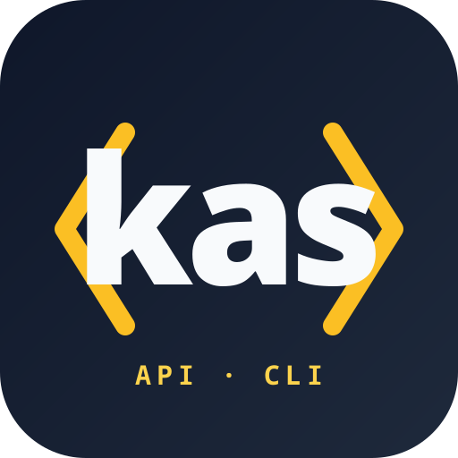

<p align="center">
  
</p>

# kasapi-cli

> [!IMPORTANT]
> An independent open-source KAS-API CLI written in Go that communicates with the KAS-API from All-Inkl.com. Not affiliated with All-Inkl.com.

## Disclaimer

> [!IMPORTANT]
> This tool interacts with the KAS API and can modify domains, DNS records, and other account-related settings.
>
> Use this software at your own risk.
>
> The author assumes no liability for any damage, data loss, service disruption, or misconfiguration caused by the use of this tool, to the extent permitted by applicable law.
>
> Always verify commands and test changes in a safe environment before applying them to production systems.
>
> This project is not affiliated with or endorsed by All-Inkl.com.

## Status

Early development. The transport, authentication, configuration, and several read modules are wired up; many write paths and the remaining read endpoints are still pending — see [ROADMAP.md](ROADMAP.md) for the current state. The repository also ships recorded KAS-API response fixtures under `testdata/` that drive offline parser tests.

## What it does

`kasapi-cli` is a command-line client for the All-Inkl KAS-API. It wraps the SOAP/`ns2:Map` wire format the API uses, handles the `KasAuth` credential-token flow (plain or session, optional 2FA), enforces the `KasFloodDelay` between calls, and exposes read and write operations for the resources documented at <https://kasapi.kasserver.com/dokumentation/phpdoc/>.

## Building

```sh
go build ./cmd/kasapi-cli
go test ./...
```

## Configuration

`kasapi-cli` resolves credentials in this precedence (highest first):

1. `--login`, `--auth-data`, `--auth-type` flags on the command,
2. environment variables `KAS_LOGIN`, `KAS_AUTHDATA`, `KAS_AUTHTYPE`,
3. the active profile from the config file (`--profile <name>` if given, otherwise `default_profile`).

Each field is resolved independently, so a flag can override a single profile field without re-specifying the whole profile.

### Config file

Default location (Linux): `$XDG_CONFIG_HOME/kasapi-cli/config.toml`, falling back to `$HOME/.config/kasapi-cli/config.toml`. macOS and Windows use the equivalent OS-specific config dir. Override with `--config <path>`.

The file is TOML; profiles live under `[profiles.<name>]`. `auth_type` accepts `plain` or `session`.

```toml
# ~/.config/kasapi-cli/config.toml
default_profile = "main"

[profiles.main]
# session: bootstrap a credential token via KasAuth and reuse it for the
# call sequence. Required for 2FA. Recommended for interactive use.
login     = "w0000000"
auth_data = "your-account-password"
auth_type = "session"

[profiles.scripted]
# plain: send the password on every KasApi call. No KasAuth round-trip,
# but no 2FA support either. Useful for one-shot scripted calls.
login     = "w0000001"
auth_data = "service-account-password"
auth_type = "plain"
```

Pick a non-default profile with `--profile <name>`:

```sh
kasapi-cli --profile scripted accounts list
```

### Environment variables

Useful for CI, sandboxes, and `direnv`-style per-directory overrides:

| Variable       | Maps to     | Notes                                  |
|----------------|-------------|----------------------------------------|
| `KAS_LOGIN`    | `login`     | KAS account login (`w<digits>`).       |
| `KAS_AUTHDATA` | `auth_data` | Password or pre-issued session token.  |
| `KAS_AUTHTYPE` | `auth_type` | `plain` or `session`.                  |

Env vars are consulted only when the matching flag is unset; they override the profile file.

## Quick start

The read surface that exists today covers accounts, server info, domains/subdomains/TLDs, DNS, mail, databases, FTP/Samba users, cronjobs, directory protection, software installs, DDNS users, and usage statistics. A few representative commands:

```sh
# All accounts visible to the login.
kasapi-cli accounts list

# A single account by login.
kasapi-cli accounts get w0000001

# Quota counters for the authenticated account.
kasapi-cli accounts resources

# Server / hosting information for the account.
kasapi-cli server info
```

Output formats are selected with `--output` / `-o`; the default is human-readable. JSON is available everywhere:

```sh
kasapi-cli accounts list -o json
kasapi-cli accounts list -o table
```

For the full subcommand tree run `kasapi-cli --help` (or `<subcommand> --help`).

## Troubleshooting

### `KasFloodDelay` (rate limiting)

Every successful KAS-API response carries a server-side `KasFloodDelay` (typically `0.5` s); the next call from the same login must wait at least that long. `kasapi-cli` honours it transparently — the second of two back-to-back calls will appear to hang for ~500 ms. There is also a server-side `flood_protection` fault that carries no delay value; if you see it repeatedly, slow down the caller (e.g. add a sleep in scripts).

### `no_auth` / `unknown_session` / `kas_session_invalid`

These three faults all mean "your credential token is no longer valid" — typically because the session expired, the server was restarted, or another tool invalidated the token. With `auth_type=session`, `kasapi-cli` invalidates its cached token and retries the call once with fresh credentials, so the user-visible result is just a slightly slower response. If the retry also fails the original fault is returned as a typed error and the command exits non-zero.

If you see `no_auth` with `auth_type=plain`, the password in `auth_data` is wrong — there is no token cache to invalidate, and the call will not be retried.

### `--verbose`

`--verbose` / `-v` enables logging on stderr, including the resolved credentials (with `auth_data` redacted) and the SOAP action being called. Use it to confirm which profile / env var / flag combination actually took effect.

## Contributing

See [CONTRIBUTING.md](CONTRIBUTING.md) for the repository layout, setup, coding conventions, the vertical-slice pattern used per KAS endpoint, the commit/PR workflow (incl. signed commits and the FF-push merge model required by `main`'s branch protection), and the code-review loop.

## Roadmap

The current state of the KAS-API surface — implemented vs. pending — is tracked in [ROADMAP.md](ROADMAP.md).

## License

BSD 3-Clause — see [LICENSE](LICENSE).
